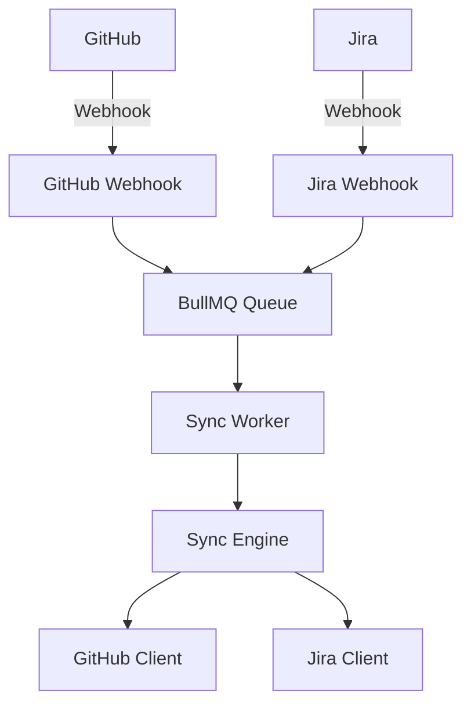

# GitHub-Jira Sync

Production-ready two-way sync between GitHub & Jira with webhook + queue architecture, conflict resolution, and enterprise-grade monitoring.

## Features

- **Two-Way Sync**: Bi-directional synchronization between GitHub Issues and Jira Issues
- **Webhook + Queue Architecture**: Reliable message processing with BullMQ
- **Conflict Resolution**: Multiple strategies (GitHub wins, Jira wins, Last write wins, Manual)
- **TypeScript + Zod**: Full type safety with runtime validation
- **Docker Compose**: Easy deployment with Redis, Prometheus, and Grafana
- **Deduplication**: Prevents duplicate processing of events
- **Monitoring**: Prometheus metrics with Grafana dashboards

## Architecture



## Quick Start

### Prerequisites

- Node.js 20+
- Redis 7+
- Docker & Docker Compose (optional)

### Installation

```bash
# Clone the repository
git clone https://github.com/your-org/github-jira-sync.git
cd github-jira-sync

# Install dependencies
npm install

# Copy environment file
cp .env.example .env

# Edit .env with your credentials
```

### Configuration

Edit `.env` with your settings:

```env
# GitHub
GITHUB_WEBHOOK_SECRET=your_webhook_secret
GITHUB_TOKEN=your_github_token
GITHUB_ORG=your_org
GITHUB_REPO=your_repo

# Jira
JIRA_HOST=your-domain.atlassian.net
JIRA_EMAIL=your-email@example.com
JIRA_API_TOKEN=your_jira_token
JIRA_PROJECT_KEY=PROJECT

# Redis
REDIS_HOST=localhost
REDIS_PORT=6379
```

### Running

#### Development

```bash
npm run dev
```

#### Docker Compose

```bash
docker-compose up -d
```

This starts:
- Application on port 3000
- Redis on port 6379
- Prometheus on port 9091
- Grafana on port 3001

### Webhook Setup

#### GitHub
1. Go to Repository Settings → Webhooks
2. Add webhook:
   - URL: `https://your-domain.com/webhooks/github`
   - Events: Issues, Issue comments

#### Jira
1. Go to Settings → System → Webhooks
2. Create webhook:
   - URL: `https://your-domain.com/webhooks/jira`
   - Events: Issue created, updated, deleted, Comment created, updated

## API Endpoints

| Endpoint | Method | Description |
|----------|--------|-------------|
| `/health` | GET | Health check |
| `/webhooks/github` | POST | GitHub webhook receiver |
| `/webhooks/jira` | POST | Jira webhook receiver |
| `/api/queues` | GET | Queue statistics |
| `/api/sync/github/:number` | POST | Manual sync (GitHub→Jira) |
| `/api/sync/jira/:key` | POST | Manual sync (Jira→GitHub) |

## Conflict Resolution Strategies

Configure via `SYNC_CONFLICT_RESOLUTION`:

- `GITHUB_WINS`: GitHub data takes precedence
- `JIRA_WINS`: Jira data takes precedence
- `LAST_WRITE_WINS`: Most recent update wins
- `MANUAL`: Requires manual intervention

## Monitoring

### Prometheus Metrics

Access metrics at `http://localhost:9090/metrics`

Key metrics:
- `github_jira_sync_jobs_total` - Total sync jobs
- `github_jira_sync_job_duration_seconds` - Processing time
- `github_jira_sync_conflicts_detected_total` - Conflicts detected
- `github_jira_sync_deduplication_hits_total` - Duplicates filtered

### Grafana Dashboard

Import `grafana/dashboards/dashboard.json` for visualization.

## Scaling

See [docs/SCALING.md](docs/SCALING.md) for:
- Horizontal scaling strategies
- Redis optimization
- Queue tuning
- Capacity planning

## Testing

```bash
# Run unit tests
npm test

# Run integration tests
npm run test:integration
```

## Project Structure

```
src/
├── config.ts         # Configuration loader
├── types.ts          # TypeScript types + Zod schemas
├── logger.ts         # Winston logging
├── server.ts         # Express server
├── index.ts          # Entry point
├── core/
│   ├── github-client.ts   # GitHub API client
│   ├── jira-client.ts    # Jira API client
│   └── sync-engine.ts     # Sync logic
├── queue/
│   ├── index.ts           # BullMQ queue setup
│   └── worker.ts          # Job processor
├── webhooks/
│   ├── github.ts     # GitHub webhook handler
│   └── jira.ts      # Jira webhook handler
├── deduplication/   # Event deduplication
├── conflict-resolution/  # Conflict handling
└── monitoring/      # Prometheus metrics
```

## License

MIT
