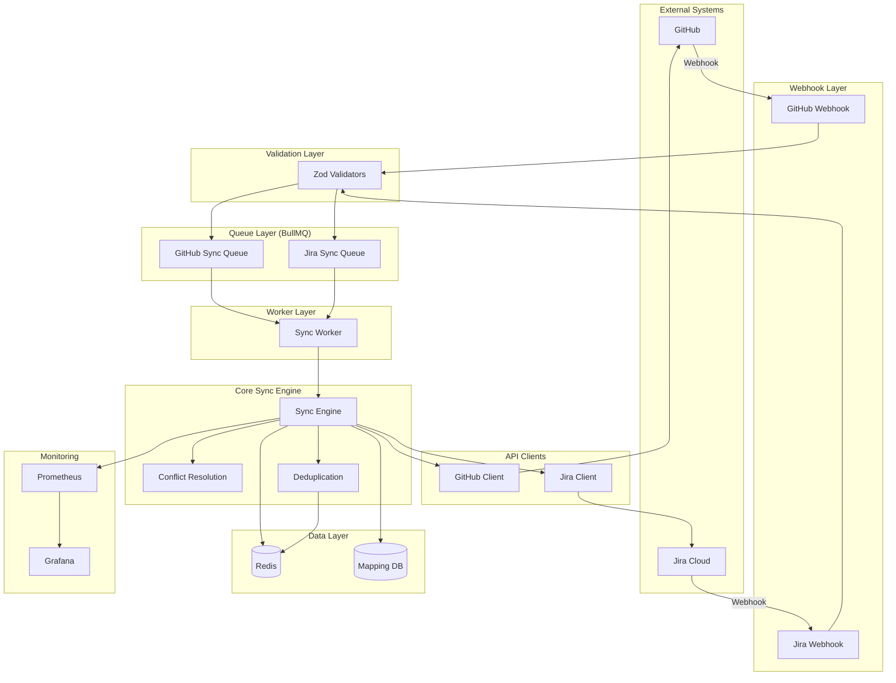
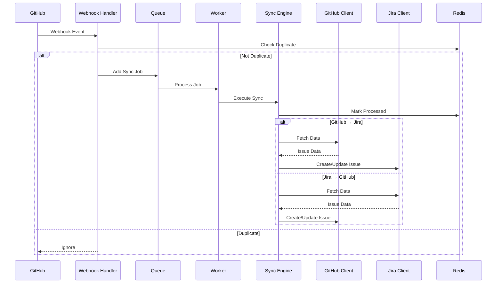
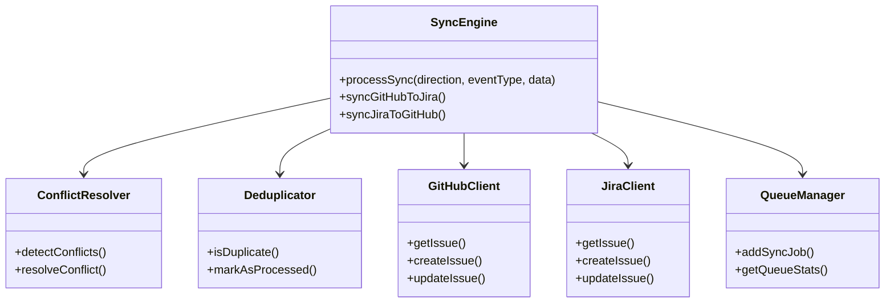
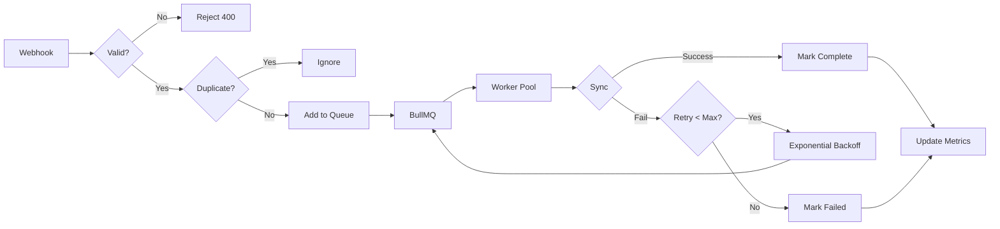
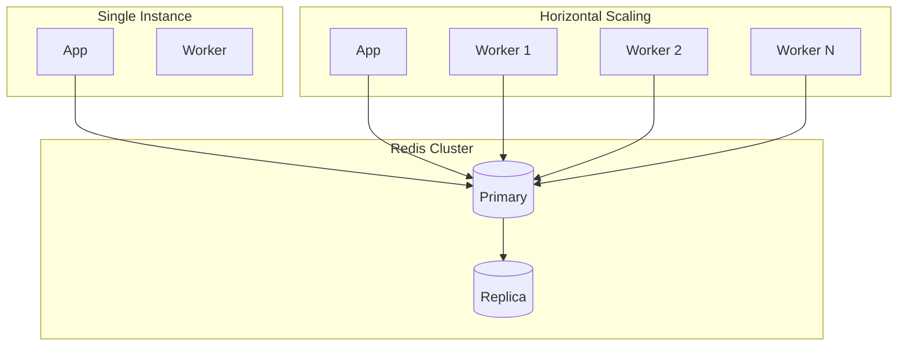
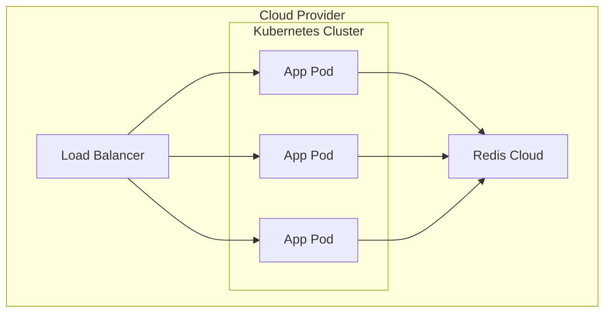

# GitHub-Jira Sync Architecture

## System Overview

```mermaid
flowchart TB
    subgraph External["External Systems"]
        GH[GitHub]
        Jira[Jira Cloud]
    end

    subgraph WebhookLayer["Webhook Layer"]
        GWH[GitHub Webhook]
        JWH[Jira Webhook]
    end

    subgraph Validation["Validation Layer"]
        ZG[Zod Validators]
    end

    subgraph Queue["Queue Layer (BullMQ)"]
        Q1[GitHub Sync Queue]
        Q2[Jira Sync Queue]
    end

    subgraph Worker["Worker Layer"]
        W[Sync Worker]
    end

    subgraph Core["Core Sync Engine"]
        SE[Sync Engine]
        CR[Conflict Resolution]
        DD[Deduplication]
    end

    subgraph Clients["API Clients"]
        GC[GitHub Client]
        JC[Jira Client]
    end

    subgraph Storage["Data Layer"]
        Redis[(Redis)]
        DB[(Mapping DB)]
    end

    subgraph Monitoring["Monitoring"]
        PM[Prometheus]
        GF[Grafana]
    end

    GH -->|Webhook| GWH
    Jira -->|Webhook| JWH

    GWH --> ZG
    JWH --> ZG

    ZG --> Q1
    ZG --> Q2

    Q1 --> W
    Q2 --> W

    W --> SE
    SE --> CR
    SE --> DD

    SE --> GC
    SE --> JC

    GC --> GH
    JC --> Jira

    SE --> Redis
    SE --> DB
    DD --> Redis

    SE --> PM
    PM --> GF
```

## Data Flow

```mermaid
sequenceDiagram
    participant GH as GitHub
    participant WH as Webhook Handler
    participant Q as Queue
    participant W as Worker
    participant SE as Sync Engine
    participant GC as GitHub Client
    participant JC as Jira Client
    participant R as Redis

    GH->>WH: Webhook Event
    WH->>R: Check Duplicate
    alt Not Duplicate
        WH->>Q: Add Sync Job
        Q->>W: Process Job
        W->>SE: Execute Sync
        SE->>R: Mark Processed
        alt GitHub → Jira
            SE->>GC: Fetch Data
            GC-->>SE: Issue Data
            SE->>JC: Create/Update Issue
        else Jira → GitHub
            SE->>JC: Fetch Data
            JC-->>SE: Issue Data
            SE->>GC: Create/Update Issue
        end
    else Duplicate
        WH-->>GH: Ignore
    end
```

## Component Architecture

```mermaid
classDiagram
    class SyncEngine {
        +processSync(direction, eventType, data)
        +syncGitHubToJira()
        +syncJiraToGitHub()
    }

    class ConflictResolver {
        +detectConflicts()
        +resolveConflict()
    }

    class Deduplicator {
        +isDuplicate()
        +markAsProcessed()
    }

    class QueueManager {
        +addSyncJob()
        +getQueueStats()
    }

    class GitHubClient {
        +getIssue()
        +createIssue()
        +updateIssue()
    }

    class JiraClient {
        +getIssue()
        +createIssue()
        +updateIssue()
    }

    SyncEngine --> ConflictResolver
    SyncEngine --> Deduplicator
    SyncEngine --> GitHubClient
    SyncEngine --> JiraClient
    SyncEngine --> QueueManager
```

## Queue Processing Flow

```mermaid
flowchart LR
    A[Webhook] --> B{Valid?}
    B -->|No| C[Reject 400]
    B -->|Yes| D{Duplicate?}
    D -->|Yes| E[Ignore]
    D -->|No| F[Add to Queue]
    F --> G[BullMQ]
    G --> H[Worker Pool]
    H --> I{Sync}
    I -->|Success| J[Mark Complete]
    I -->|Fail| K{Retry < Max?}
    K -->|Yes| L[Exponential Backoff]
    K -->|No| M[Mark Failed]
    L --> G
    J --> N[Update Metrics]
    M --> N
```

## Scaling Strategy

```mermaid
flowchart TB
    subgraph Single["Single Instance"]
        App1[App]
        W1[Worker]
    end

    subgraph Horizontal["Horizontal Scaling"]
        App2[App]
        W2[Worker 1]
        W3[Worker 2]
        W4[Worker N]
    end

    subgraph Redis["Redis Cluster"]
        R1[(Primary)]
        R2[(Replica)]
    end

    App1 --> R1
    App2 --> R1
    W2 --> R1
    W3 --> R1
    W4 --> R1
    R1 --> R2
```

## Deployment Architecture

```mermaid
flowchart TB
    subgraph Cloud["Cloud Provider"]
        LB[Load Balancer]
        
        subgraph K8s["Kubernetes Cluster"]
            Pod1[App Pod]
            Pod2[App Pod]
            Pod3[App Pod]
        end
        
        RedisCloud[Redis Cloud]
    end

    LB --> Pod1
    LB --> Pod2
    LB --> Pod3

    Pod1 --> RedisCloud
    Pod2 --> RedisCloud
    Pod3 --> RedisCloud
```
