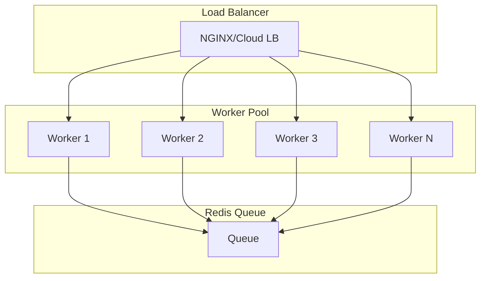

# Scaling Strategies

## Overview

The GitHub-Jira Sync service is designed to handle high-volume synchronization between GitHub and Jira. This document outlines strategies for scaling the service to meet enterprise demands.

## Horizontal Scaling

### Architecture



### Scaling Guidelines

| Instance Count | Requests/sec | Queue Capacity |
|--------------|--------------|----------------|
| 1           | 150          | 10,000         |
| 3           | 450          | 30,000         |
| 5           | 750          | 50,000         |
| 10          | 1,500        | 100,000        |

### Auto-Scaling Rules

```yaml
# Kubernetes HPA Example
apiVersion: autoscaling/v2
kind: HorizontalPodAutoscaler
metadata:
  name: github-jira-sync
spec:
  scaleTargetRef:
    apiVersion: apps/v1
    kind: Deployment
    name: github-jira-sync
  minReplicas: 2
  maxReplicas: 20
  metrics:
  - type: Resource
    resource:
      name: cpu
      target:
        type: Utilization
        averageUtilization: 70
  - type: Pods
    pods:
      metric:
        name: queue_waiting_jobs
      target:
        type: AverageValue
        averageValue: "100"
```

## Redis Optimization

### Connection Pooling

```typescript
// Redis connection pool configuration
const pool = createPool(
  {
    host: process.env.REDIS_HOST,
    port: parseInt(process.env.REDIS_PORT || '6379'),
    password: process.env.REDIS_PASSWORD,
    maxRetriesPerRequest: null,
  },
  { 
    min: 5, 
    max: 20 
  }
);
```

### Memory Management

```redis
# redis.conf
maxmemory 512mb
maxmemory-policy allkeys-lru
save 900 1
save 300 10
appendonly yes
appendfsync everysec
```

### Cluster Mode

For very high throughput:

```yaml
# docker-compose.cluster.yml
services:
  redis:
    image: redis:7-alpine
    command: >
      redis-server
      --cluster-enabled yes
      --cluster-config-file nodes.conf
      --cluster-node-timeout 5000
      --appendonly yes
    ports:
      - "6379-6384:6379-6384"
```

## Queue Optimization

### Priority Queues

```typescript
// Different priority levels
await queue.add('high-priority', jobData, { priority: 1 });
await queue.add('normal', jobData, { priority: 2 });
await queue.add('low-priority', jobData, { priority: 3 });
```

### Rate Limiting

```typescript
const worker = new Worker('sync', processor, {
  limiter: {
    max: 100,    // Max 100 jobs
    duration: 1000, // Per second
  },
  concurrency: 10,
});
```

### Dead Letter Queue

```typescript
const queue = new Queue('sync', {
  defaultJobOptions: {
    attempts: 3,
    backoff: {
      type: 'exponential',
      delay: 2000,
    },
    removeOnComplete: false, // Keep for analysis
  },
});
```

## Database Considerations

### Mapping Storage

For production, use a persistent database for issue mappings:

```typescript
// PostgreSQL for mapping storage
const mappingSchema = pgTable('issue_mappings', {
  id: serial('id').primaryKey(),
  githubIssueId: integer('github_issue_id').notNull(),
  githubRepo: text('github_repo').notNull(),
  jiraKey: text('jira_key').notNull(),
  jiraProjectKey: text('jira_project_key').notNull(),
  createdAt: timestamp('created_at').defaultNow(),
  updatedAt: timestamp('updated_at').defaultNow(),
  syncVersion: integer('sync_version').default(1),
});
```

### Read Replicas

For high-read scenarios:

```typescript
// Configure read replicas
const pgMaster = new Pool({ host: 'master-db' });
const pgReplicas = [
  new Pool({ host: 'replica1' }),
  new Pool({ host: 'replica2' }),
];

// Use replica for reads
async function getMapping(githubId: number) {
  const replica = pgReplicas[Math.floor(Math.random() * pgReplicas.length)];
  return replica.query('SELECT * FROM issue_mappings WHERE github_issue_id = $1', [githubId]);
}
```

## Caching Strategy

### Multi-Layer Cache

```typescript
// L1: In-memory cache
const memoryCache = new Map<string, CachedValue>();

// L2: Redis cache
const redisCache = {
  async get(key: string) {
    const value = await redis.get(`cache:${key}`);
    return value ? JSON.parse(value) : null;
  },
  
  async set(key: string, value: unknown, ttl: number = 300) {
    await redis.setex(`cache:${key}`, ttl, JSON.stringify(value));
  },
};

// Cache wrapper
async function cachedGet(key: string, fetcher: () => Promise<unknown>) {
  // Check L1
  if (memoryCache.has(key)) {
    return memoryCache.get(key);
  }
  
  // Check L2
  const cached = await redisCache.get(key);
  if (cached) {
    memoryCache.set(key, cached);
    return cached;
  }
  
  // Fetch and cache
  const value = await fetcher();
  memoryCache.set(key, value);
  await redisCache.set(key, value);
  
  return value;
}
```

## Monitoring & Alerts

### Key Metrics

| Metric | Threshold | Action |
|--------|-----------|--------|
| Queue waiting | > 1000 | Scale up workers |
| Queue active | > 100 | Check processing time |
| Error rate | > 1% | Alert on-call |
| Processing time | > 5s | Investigate API latency |
| Memory usage | > 80% | Review cache size |

### Dashboard Queries

```promql
# Sync throughput
rate(github_jira_sync_jobs_total[5m])

# Error rate
rate(github_jira_sync_errors_total[5m]) / rate(github_jira_sync_jobs_total[5m])

# Queue depth
github_jira_sync_queue_waiting_jobs

# Processing latency
histogram_quantile(0.95, rate(github_jira_sync_job_duration_seconds_bucket[5m]))
```

## Disaster Recovery

### Backup Strategy

```yaml
# Daily backup job
apiVersion: batch/v1
kind: CronJob
metadata:
  name: github-jira-sync-backup
spec:
  schedule: "0 2 * * *"
  jobTemplate:
    spec:
      template:
        spec:
          containers:
          - name: backup
            image: redis:latest
            command: ['redis-cli', 'SAVE']
          restartPolicy: OnFailure
```

### Failover Configuration

```typescript
// Multi-region deployment
const regions = {
  primary: { host: 'redis-primary', region: 'us-east-1' },
  secondary: { host: 'redis-secondary', region: 'us-west-2' },
};

async function getRedis() {
  try {
    return await connect(regions.primary);
  } catch {
    return await connect(regions.secondary);
  }
}
```

## Capacity Planning

### Baseline Requirements

| Scale | CPU | Memory | Redis |
|-------|-----|--------|-------|
| 100 issues/min | 500m | 256Mi | 256MB |
| 500 issues/min | 2 cores | 512Mi | 512MB |
| 1000 issues/min | 4 cores | 1Gi | 1GB |

### Growth Projections

```
Month 1:  10,000 issues  → 1 instance
Month 3:  50,000 issues  → 2 instances  
Month 6: 150,000 issues  → 5 instances
Month 12: 500,000 issues → 10 instances
```
